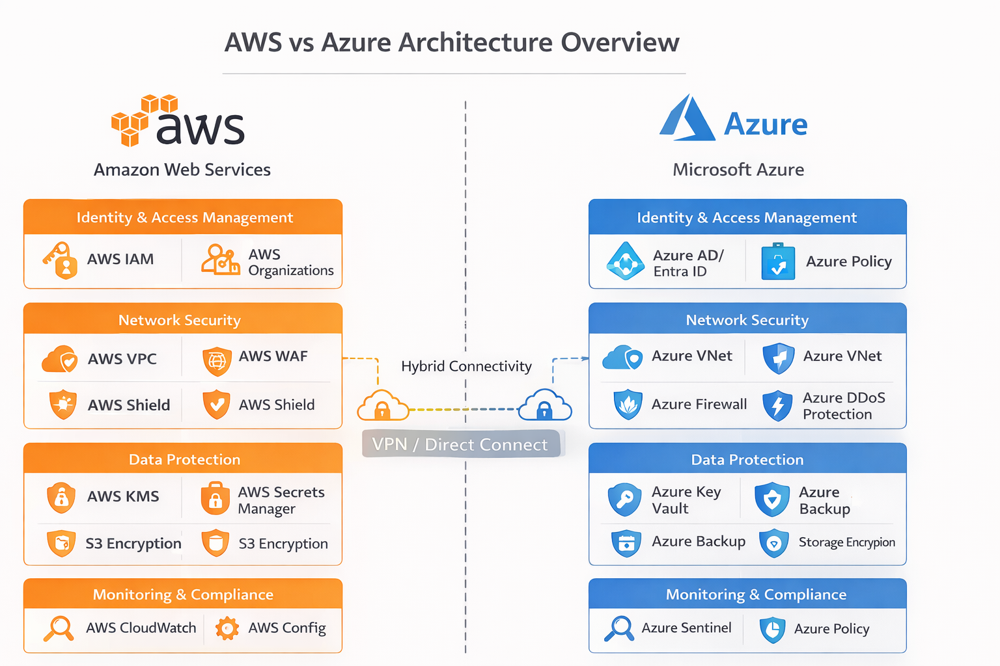
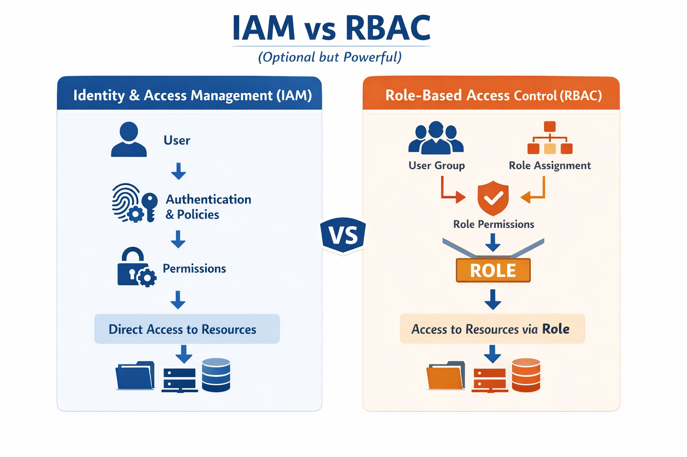
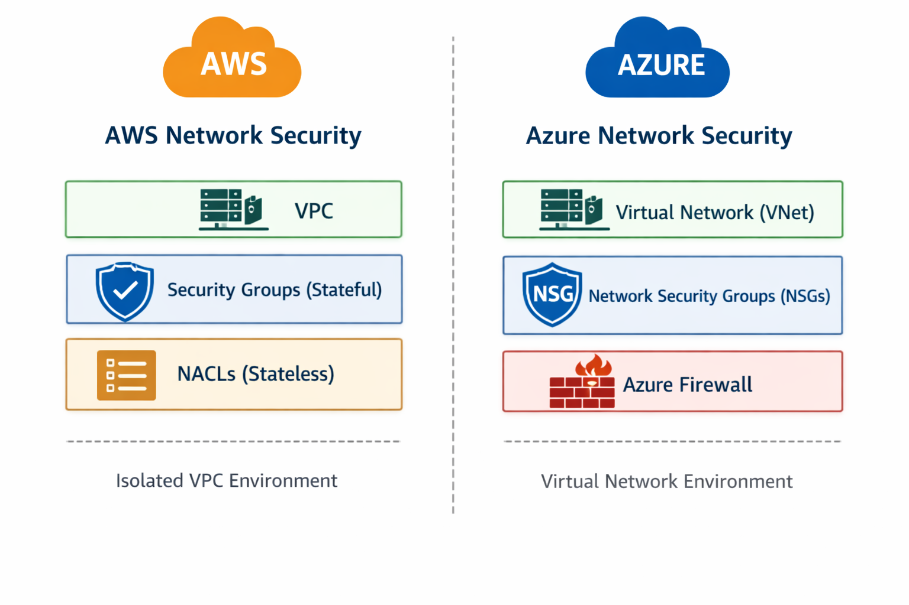
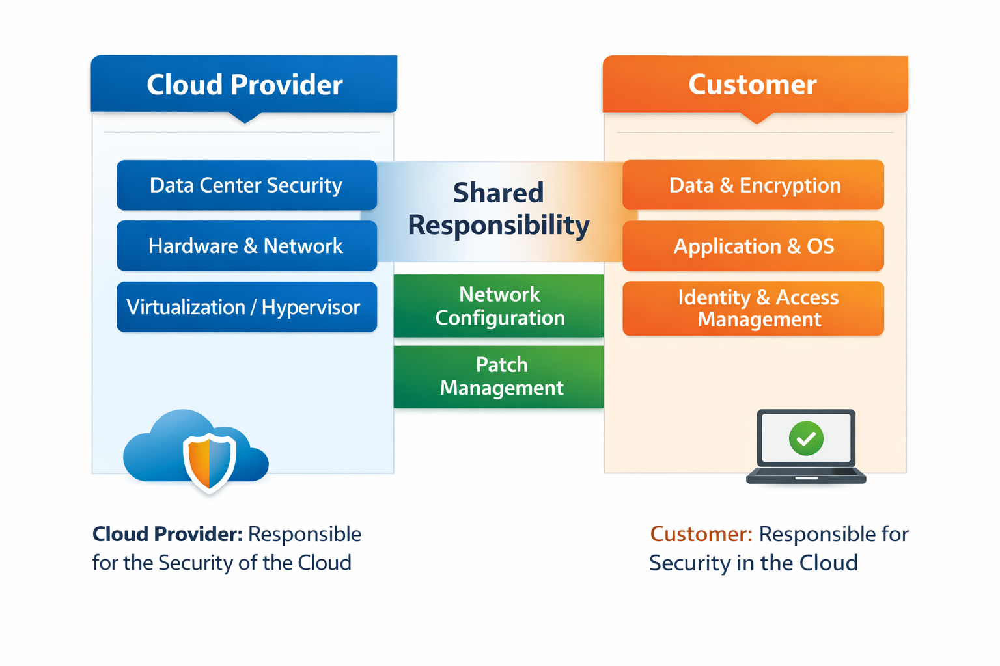

  
  

# ☁️ AWS vs Azure Cloud Security Comparison

## 📌 Overview
This project presents a detailed comparative analysis of security features offered by Amazon Web Services (AWS) and Microsoft Azure. This project helps in understanding how organizations choose between AWS and Azure based on security requirements and real-world use cases.

The focus is on understanding real-world cloud security concepts such as Identity & Access Management, Network Security, Data Protection, Monitoring, and Compliance.

---

## 🎯 Objectives
- Compare AWS and Azure security architectures
- Understand IAM (policy-based) vs RBAC (role-based) access control
- Analyze network security models (VPC vs VNet)
- Study encryption, monitoring, and compliance mechanisms

---

## 📊 Architecture Comparison

  
   
  <em>AWS vs Azure Security Architecture Overview</em>

## 🔄 IAM vs RBAC Flow

  
   
  <em>Comparison of IAM (policy-based) and RBAC (role-based) access control models</em>

## 🌐 Network Security Comparison

  
   
  <em>Comparison of AWS VPC and Azure VNet network security architectures</em>

## 🔐 Shared Responsibility Model

  
   
  <em>Cloud Shared Responsibility Model: Provider vs Customer responsibilities</em>

---

## 🔐 Key Comparison Areas

### 1. Identity & Access Management
- AWS: IAM (policy-based access control)
- Azure: RBAC (role-based access control)

### 2. Network Security
- AWS: VPC, Security Groups, NACLs
- Azure: Virtual Network (VNet), NSGs, Azure Firewall

### 3. Data Security
- Encryption at rest and in transit
- Key management (AWS KMS vs Azure Key Vault)

### 4. Monitoring & Logging
- AWS: CloudWatch, CloudTrail
- Azure: Azure Monitor, Microsoft Sentinel

---

## 📄 Project Report
👉 [Download Full PDF](./report/AWS_vs_Azure_Cloud_Security_Comparison.pdf)

---

## 🧠 Key Learnings
- Differences between policy-based and role-based access control
- Cloud-native security architecture design
- Importance of monitoring, logging, and compliance in cloud environments
- Real-world decision factors between AWS and Azure

---

## 🚀 Tools & Resources
- AWS Documentation
- Microsoft Azure Documentation
- Security Whitepapers
- Research-based analysis

---

## 👨‍💻 Author
Sakshat S  
Cybersecurity Student  

## 🤝 Contributor
Swasthi Kunder  

---

## 📌 Note
This is an independent research project based on official documentation and industry best practices.